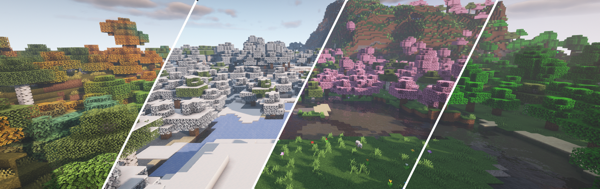

# realistic seasons

добавляет времена года, температуру, календарь и временные эвенты

#### использование:

* `/season` - узнать информацию о текущем сезоне
* `/currentbiome` - узнать текущий биом

## времена года:

<strong>весна</strong>

* безусловно, самый легкое время года, и оно подарит миру живое и теплое ощущение. деревья приобретут красивый цвет, вода и небо приобретут теплые краски, весь мир будет залит цветами, а детеныши животных будут встречаться на каждом углу. весна дарит миру особое ощущение, особенно после долгой и холодной зимы.

- весна начинается 4 марта
- листья в лесах станут розовыми, а вода приобретет легкий светло-голубой оттенок.
- цветы вишни опадают с листьев
- небо имеет светло-голубой цвет
- цветы можно найти повсюду, весь мир будет выглядеть как цветочный лес
- снег и лед, образовавшиеся зимой, будут удалены
- множество овец, коров, свиней, кроликов и кур будут появляться с 3-5 детенышей
- ночью будут появляться светлячки
- увеличенная скорость появления пчел
- средняя температура 5°C-23°C, в зависимости от биома.
- продолжительность дня и ночи в основном одинакова
- листья джунглей в биоме джунглей сохранят свой обычный цвет. в некоторых биомах также нет цветов, а только некоторые изменения цвета. средняя температура в каждом биоме различна, в пустыне весной будет намного теплее, чем в замерзшей тундре.
- а начале подсезона весны уборка снега происходит медленнее и происходит по блокам, а не целыми кусками сразу. вы заметите, что таяние становится быстрее поздней весной.
- в середине весны (до и после подсезонов) все листья дуба превращаются в листья вишни. изменения блоков происходят только на стороне клиента, то есть оригинальные листья дуба не удаляются на сервере. разрушение этих листьев вишни также приведет к падению обычных листьев дуба.&#x20;

.png>)

<strong>лето</strong>

* дни становятся длиннее, а солнце очень палящее. мир медленно превращается в большие джунгли. животные, которые обычно встречаются только в джунглях, теперь будут повсюду. деревья приобретают яркие зеленые цвета, похожие на листья джунглей, а небо и вода становятся светло-голубыми. урожай также растет очень быстро, а температура резко повышается. обязательно возьмите с собой немного воды, чтобы справиться с жарой.

- &#x20;лето начинается 4 июня
- деревья и трава в большинстве биомов имеют яркий зеленый цвет, похожий на листья джунглей
- холодные биомы (снежные равнины, тайга и т. д.) имеют цвет травы равнин
- жаркие биомы (пустыня, саванна) выглядят немного сухими
- цвет воды и неба светло-голубой
- падающие звезды можно увидеть ночью
- светлячки будут появляться ночью
- цветы, размещенные плагином весной, будут удалены
- листья опадают с деревьев
- ягодные кусты появляются повсюду
- дождь идет очень редко
- животные, которые обычно появляются в джунглях, теперь могут появляться везде
- посевы/растения без блока где-то над ними будут расти в 2 раза быстрее
- дни будут длинными (около 13 мин), а ночи будут короткими (7 мин)
- вместо зомби будут появляться кадавры
- средняя температура будет между 25°C-40°C, в зависимости от биома

<strong>осень</strong>

* дни становятся короче, а солнце теряет свою силу. деревья окрашиваются в красивые цвета, а земля и вода становятся грязными. небо темное, и кажется, что в любую минуту может разразиться шторм. лисы, грибы, лягушки, летучие мыши и (пещерные) пауки начинают появляться по всему миру. леса никогда не были такими красивыми.

- осень начинается 4 сентября
- деревья окрашиваются во все цвета: оранжевый, синий, зеленый, желтый и коричневый.
- трава имеет светло-коричневый грязный цвет
- небо имеет серый цвет
- вода коричневая и выглядит грязной
- появляются большие скопления грибов
- &#x20;дожди и штормы очень часто
- под деревьями появятся мелкие частицы (падающих листьев).
- летучие мыши появляются над землей ночью
- грибные коровы, лягушки и лисы появляются повсюду
- ночью можно встретить дополнительных пауков, а иногда даже пещерных пауков
- средняя температура будет между 5°C-25°C, в зависимости от биома
- у мобов есть 20% шанс появиться с тыквой на голове
- продолжительность дня и ночи в основном одинакова
- ягодные кусты, образующиеся летом, удаляются

.png>)

<strong>зима</strong>

* температура падает, и выживание становится настоящим испытанием. большинство растений погибло от холодного снега, а те, что выжили, не могут расти. озера и реки замерзли, и купание может быть смертельным. вода имеет темно-синий цвет, а деревья и трава светло-серые. пережить длинные и холодные ночи — это действительно испытание.

- зима начинается 4 декабря
- листья и трава имеют светло-серый оттенок
- небо немного более белое, вода темно-синяя
- все блоки источников воды без блока где-то над ними со временем замерзнут
- вместо дождя идет снег. используется фактическая текстура снега ванильного minecraft, а не частицы. снег снова будет удален после зимы
- ночи будут длинными (около 13 минут), а дни — короткими (около 7 минут).&#x20;
- волки, белые лисы, белые медведи и снеговики могут быть найдены повсюду
- вместо скелетов будут появляться зимогоры
- есть 20% шанс, что каждую ночь небо будет заполнено белыми искрами
- посевы/растения не будут расти, если над ними не будет блока (где-то). стоит строить крытые фермы, если хотятите выращивать урожай зимой
- средняя температура будет между -10°C и 5°C, в зависимости от биома
- игрокам придется защищать себя от низких температур. вот как можно это делать
- междусезонья. расположение снега и льда меняется между междусезоньями. в начале зимы снег может быть виден в воздухе, но, скорее всего, не будет помещен на землю из-за относительно высоких температур. образование льда происходит медленно и начинается снаружи озер и растет внутрь, как показано ниже:

.png>)

<strong>сезонные животные</strong>

* после окончания сезона эти животные автоматически исчезнут. игроки могут остановить исчезновение животных, разводя, кормя, присваивая им имена или приручая их. пчелы также не исчезнут, если им дать улей. эти механики гарантируют, что целые фермы не исчезнут после окончания сезона.&#x20;
* некоторые животные ведут себя не так, как их обычный ванильный вариант. например, волки, лисы и оцелоты не агрессивны по отношению к другим животным. у них есть шанс появиться на ферме игрока, и они могли бы убить всех. снеговики появляются без тыквы на голове (см. скриншоты в зимнем спойлере), и они пассивны по отношению к мобам. это предотвращает возникновение огромных боев ночью, приводящих к ландшафту, полному кратеров от криперов.

## сезонные эвенты:

<strong>рождество</strong>

* подарки появляются под деревьями в деревнях.
* максимум одно дерево на деревню.
* подарки быстро исчезают после окончания рождества.
* специальные частицы появляются ночью

 (1).png>)

<strong>новый год</strong>

* в деревнях появляются фейерверочные торты в полночь, создавая красивые фейерверочные шо
* каждый фейерверочный торт имеет один из семи уникальных шаблонов стрельбы, включая взрывы, фонтаны и более длинные ракеты. цвета также случайны
* фейерверочный торт существует 45 секунд, после чего исчезает. ближайший житель попытается сразу же создать новый. также существует минимальное расстояние между появляющимися тортами
* фейерверочные шоу продолжаются до рассвета

 (1).png>)

<strong>пасха</strong>

* пасхальные яйца будут спрятаны по всему миру
* пасхальные яйца не появляются близко друг к другу
* яйца быстро исчезают после окончания события
* опасные кролики появляются ночью

 (1).png>)

<strong>хэллоуин</strong>

* мобы могут появляться с особыми усилениями
* мобы, подверженные усилению на хэллоуин, окружены огненными частицами
* виндикаторы могут появляться ночью.
* усиления включают:
  * скорость
  * дополнительная броня
  * горящие стрелы (скелеты)
  * больше типов зелий (ведьмы)
  * дублирование при ударе (удар по некоторым мобам может вызвать частичный эффект, создающий 4-5 мобов того же типа)
  * невидимость при ударе (удар по некоторым мобам делает их невидимыми)

## температура:

<strong>описание</strong>

* многие вещи меняют температуру игроков: сезон, биом, броня, погода, время, вода, еда, рост, бег, блокировка света и многое другое. ознакомьтесь с модификаторами для полного списка
* игроки будут наказаны за плохую температуру. эффекты начинаются с -10 °C и с 50 °C. эффекты включают голод, медлительность, заморозку (с повреждением), отключение лечения и горение. подробнее см. в эффектах. некоторые эффекты только визуальные, например, игрок начинает потеть, когда его температура превышает 40°C, или дыхание игрока становится видимым, если температура воздуха ниже 0°C.

## эффекты:

| температура                  | эффект                                                   |
| ---------------------------- | -------------------------------------------------------- |
| ниже -20°C                   | заморозка и повреждение половины сердца каждые 2 секунды |
| ниже -15°C                   | замедление                                               |
| ниже -10°C                   | голод                                                    |
| температура воздуха ниже 0°C | дыхание становится видимым                               |
| выше 40°C                    | игрок начинает потеть                                    |
| выше 50°C                    | нет лечения                                              |
| выше 60°C                    | замедление                                               |
| выше 65°C                    | горение                                                  |

плагин будет предупреждать игроков, если они достигнут опасной температуры, через панель действий и чат.

## модификаторы:

температурный модификатор — это то, что изменяет температуру игрока. каждый мир имеет базовую температуру, основанную на сезоне, и все модификаторы накладываются на нее. результатом базовой температуры и всех модификаторов является температура, которую увидит игрок. модификаторы делают температурную систему очень динамичной и интересной для игры. большинство модификаторов различны для каждого игрока в зависимости от его ситуации. полная температура пересчитывается каждые 2 секунды. вот список всех модификаторов в порядке их применения.

* каждый мир имеет случайно сгенерированную базовую температуру. эта температура рандомизируется каждый день и основана на текущем сезоне.&#x20;

<table><thead><tr><th>время года</th><th width="249">минимальная</th><th>максимальная</th></tr></thead><tbody><tr><td>зима</td><td>-12°C</td><td>0°C</td></tr><tr><td>весна</td><td>0°C</td><td>20°C</td></tr><tr><td>лето</td><td>20°C</td><td>40°C</td></tr><tr><td>осень</td><td>5°C</td><td>20°C</td></tr></tbody></table>

* текущая погода также влияет на температуру.

| погода     | модификатор |
| ---------- | ----------- |
| ясная      | 0°C         |
| дождь/снег | -4°C        |
| гром       | -5°C        |

* время

вы заметите, что ночи немного холоднее, а дни немного теплее. модификатор времени постепенно меняется от -5°C между временами minecraft 14800-23500 (19:00 - 06:00) до +3°C между 6000-12000 (06:00 - 12:00).

* биомы&#x20;

биом, в котором находится игрок, играет большую роль в расчете температуры игрока. Все значения можно изменить в конфигурации биома. Вот список модификаторов по умолчанию для всех биомов:

| биом(ы)                                                                                        | модификатор |
| ---------------------------------------------------------------------------------------------- | ----------- |
| пустошь, пустыня                                                                               | +15°C       |
| джунгли                                                                                        | +12°C       |
| саванна                                                                                        | +10°C       |
| пляж, березовый лес, темный лес, цветочный лес, луг, лес, грибные поля, океан, равнины, болото | 0°C         |
| горы, тайга                                                                                    | -4°C        |
| 
снежные/замерзшие биомы, снежные/замерзшие горы 
                                     | -12°C       |

* высота&#x20;

температура уменьшается на 0,08°C в каждом блоке выше y=64 во все сезоны, кроме зимы. температура зимой остается прежней выше y=64 и вместо этого увеличивается на 0,2°C в каждом блоке ниже y=64.

* вода/снег&#x20;

нахождение в воде или снегу сильно влияет на температуру игрока. прыжок в воду без защиты зимой может быть смертельным. модификатор также сохраняется в течение короткого времени после того, как игрок выбрался из воды, поскольку игрок все еще мокрый. модификатор увеличивается на 1°C каждые 2 секунды после того, как игрок выбрался из воды, пока модификатор снова не станет 0°C. модификатор точно так же работает для снега.

| время года   |       |
| ------------ | ----- |
| лето, зима   | -10°C |
| весна, осень | -4°C  |

* бег&#x20;

бег добавляет максимум +4°C к температуре игрока. отличный способ быстро согреться, если это необходимо.

* эффекты блоков&#x20;

блоки в максимальном радиусе 16 блоков могут оказывать любое температурное воздействие на игрока. игрок должен видеть блок, чтобы модификатор был применен, а фактический модификатор изменяется в зависимости от расстояния до блока.

| блок                    | радиус (блоков) | модификатор |
| ----------------------- | --------------- | ----------- |
| лава                    | 7               | +22°C       |
| факел, фонарь           | 7               | +7°C        |
| костер                  | 7               | +15°C       |
| огонь                   | 7               | +16°C       |
| костер души             | 7               | -10°C       |
| огонь души              | 7               | -16°C       |
| факел души, фонарь души | 7               | -7°C        |
| лед                     | 3               | -6°C        |
| плотный лед             | 3               | -6°C        |
| голубой лед             | 7               | -15°C       |

* броня&#x20;

броня отлично защищает от холода, но летом она также может стать причиной перегрева. вот полный список модификаторов:

| материал              | один элемент брони | полный сет |
| --------------------- | ------------------ | ---------- |
| кожа                  | +5°C\*             | +20°C\*    |
| железо, золото, алмаз | +1,25°C            | +5°C       |
| незерит               | +0,75°C            | +3°C       |

\*= модификатор не будет применяться, если температура игрока превышает 25°C

* еда&#x20;

в настоящее время в плагине есть два эффекта еды. один, если ваша температура выше 25°C, другой, если ваша температура ниже. полная полоска голода применит +5°C к вашей температуре, если ваша текущая температура ниже 25°C. выпивая бутылку воды, вы снизите свою температуру на -10°C на 5 минут (не суммируется), если ваша температура превышает 25°C. рядом с вашим термометром появится значок бутылки, чтобы сообщить вам, что эффект бутылки с водой все еще активен. вам не обязательно пить бутылку воды, подойдет и зелье

